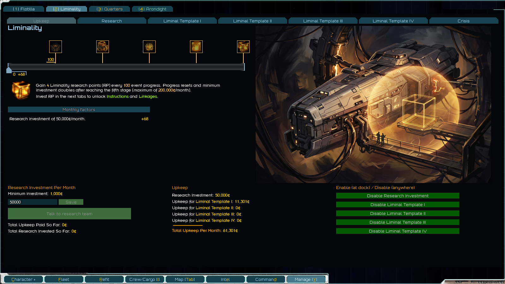
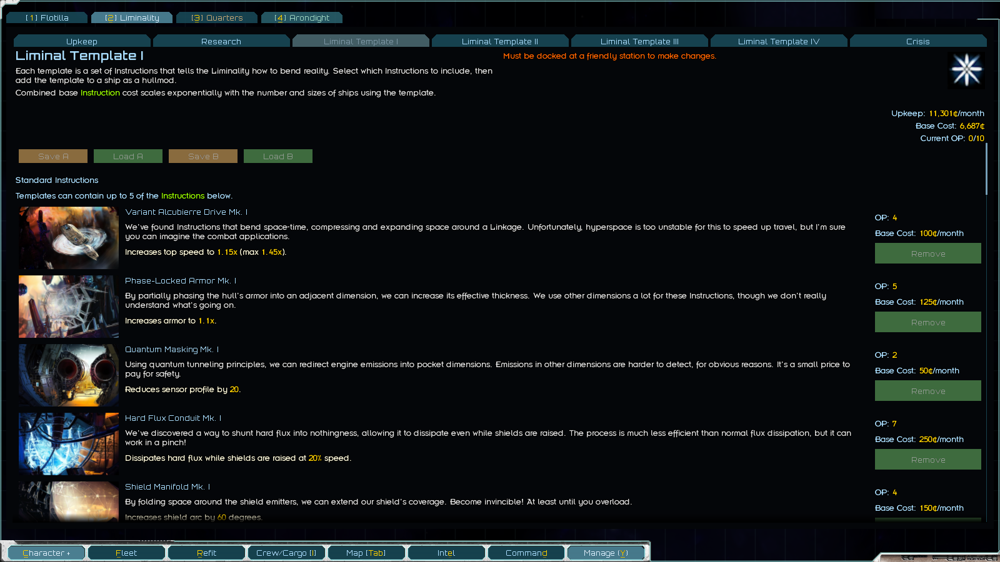
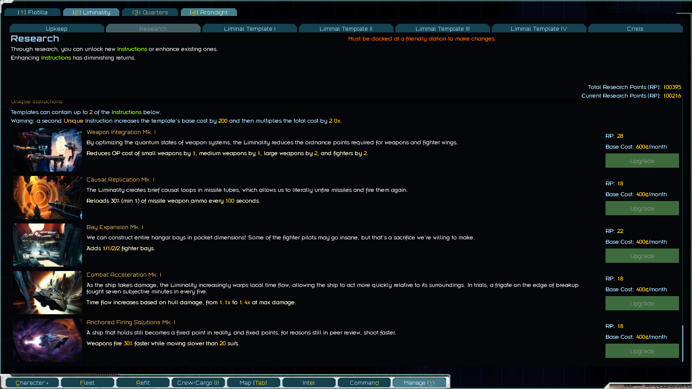
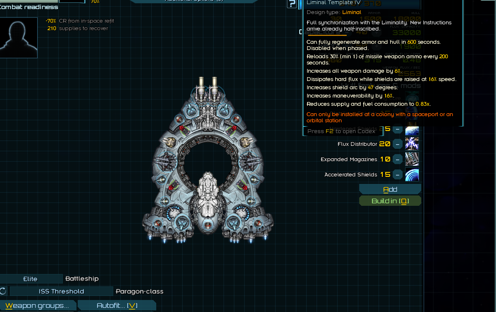

# Liminal: Custom, Upgradeable Hullmods
> Using a hole in reality to change the laws of physics. What could possibly go wrong?
> - Last words of a Galatia Academy Researcher

Create custom, upgradeable hullmods that rewrite reality. Unlock, upgrade, and slot together different effects into templates, that can be equipped as hullmods onto your ships. Research costs credits, as does using templates (so you probably can't equip a massive fleet with these).

Delve too deep and trigger an *extremely* difficult endgame crisis. This is the most *difficult* modded content I know of (especially on harder difficulties).

Begin your journey today at the Galatia Academy!

[Forum link](https://fractalsoftworks.com/forum/index.php?topic=31649.0)

## Screenshots

